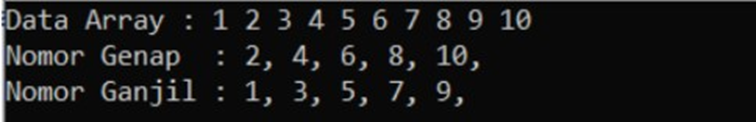

# <h1 align="center">Laporan Praktikum Modul 2 - ARRAY</h1>
<p align="center">Fadhel Setiawan - 2311102171</p>

# Dasar Teori 

Array merupakan struktur data yang paling dasar. Sebelum mempelajari struktur data
lainnya, alangkah baiknya, kita perlu mempelajari Array terlebih dahulu. Berikut ini
adalah beberapa jenis array :

1) Array Satu Dimensi</br>
Array satu dimensi adalah tipe variabel yang terdiri dari kumpulan data dengan tipe yang sama yang disusun dalam satu baris atau satu dimensi. Setiap elemen di dalam array memiliki sebuah indeks atau nomor yang digunakan untuk mengakses elemen tersebut. Indeks dimulai dari 0 dan berakhir pada jumlah elemen dikurangi satu.
Contohnya, sebuah array satu dimensi yang berisi bilangan bulat {1, 2, 3, 4, 5} memiliki lima elemen dan indeksnya dimulai dari 0. Indeks 0 merujuk pada elemen pertama, indeks 1 merujuk pada elemen kedua, dan seterusnya hingga indeks 4 merujuk pada elemen kelima Contoh : 

```C++
#include <iostream>
using namespace std;
int main() {
int arr[5] = {9, 3, 5, 2, 1}; //deklarasi array
cout<< arr[1] << endl;
cout<< arr[4];
}
```

2) Array Dua Dimensi</br>
Array dua dimensi adalah variable yang terdiri dari kumpulan array satu dimensi dengan tipe yang sama yang disusun dalam baris dan kolom. Dalam array dua dimensi, setiap elemen memiliki dua indeks, yaitu indeks baris dan indeks kolom. Indeks baris menunjukkan posisi elemen dalam baris, sementara indeks kolom menunjukkan posisi elemen dalam kolom.
Contoh :

```C++ 
#include <iostream>
using namespace std;
int main() {
int arr[2][2] = {{3, 2}, {2, 5}};
for (int i=0; i<2; i++) { //baris
for(int j=0; j<2; j++) { //kolom
cout<< arr[i][j] << ends;
};
cout << endl;
};
}
```  

3) Array Multidimensi</br>
Array multidimensi memiliki kesamaan dengan array satu dimensi dan dua dimensi, namun memiliki kapasitas memori yang lebih besar. Array ini digunakan untuk merepresentasikan array dengan dimensi lebih dari dua atau array yang memiliki lebih dari dua indeks, seperti array tiga dimensi, array empat dimensi, array lima dimensi, dan seterusnya.
Contoh : 

```C++
#include <iostream>
using namespace std;
int main() {
int arr[2][2][3] = {{{2, 8, 7}, {6, 5, 1}}, {{8, 5, 2}, {9, 2 ,7}}}; 
for (int i=0; i<2; i++) {
for(int j=0; j<2; j++) {
for(int k=0; k<3; k++) {
cout<< arr[i][j][k] << ends;
};
cout<< endl;
};
cout<< endl;
};
}
``` 

4) Array Empat Dimensi</br>
Array berdimensi empat merupakan kumpulan dari paket-paket kartu yang setiap paket mempunyai jumlah kartu yang sama, setiap kartu dengan jumlah baris yang sama, dan setiap baris mempunyai jumlah kolom yang sama.
contoh : 

```C++ 
int arr [3][2][4][4];
```

5) Array Lima Dimensi</br>
```C++ 
int arr [2][4][4][3][3];
```

# Guided

# 1. Program Input Array Tiga Dimensi

```C++
 #include <iostream>
using namespace std;
// PROGRAM INPUT ARRAY 3 DIMENSI
int main()
{
// Deklarasi array
int arr[2][3][3];
// Input elemen
for (int x = 0; x < 2; x++)
{
for (int y = 0; y < 3; y++)
{
for (int z = 0; z < 3; z++)
{
cout << "Input Array[" << x << "][" << y << "][" << z <<"] = ";
cin >> arr[x][y][z];
    }
}
cout << endl;
}
// Output Array
for (int x = 0; x < 2; x++)
{
for (int y = 0; y < 3; y++)
{
for (int z = 0; z < 3; z++)
{
cout << "Data Array[" << x << "][" << y << "][" << z <<"] = " << arr[x][y][z] << endl;
        }
    }
}
cout << endl;
// Tampilan array
for (int x = 0; x < 2; x++)
{
for (int y = 0; y < 3; y++)
{
for (int z = 0; z < 3; z++)
{
cout << arr[x][y][z] << ends;
}
cout << endl;
}
cout << endl;
}
}

```

# Output
</br>
Program tersebut adalah sebuah program sederhana dalam bahasa pemrograman C++ yang memungkinkan pengguna untuk memasukkan data ke dalam array tiga dimensi dan kemudian menampilkannya.program meminta pengguna untuk memasukkan nilai ke dalam setiap elemen array menggunakan perulangan for. setelah itu program menampilkan kembali nilai-nilai array tanpa pesan, hanya nilainya saja. Jadi, secara keseluruhan, program ini memungkinkan pengguna untuk memasukkan nilai ke dalam array tiga dimensi dan kemudian menampilkan nilai-nilai tersebut.

# 2. Program Mencari Nilai Maksimal pada Array

```C++
#include <iostream>
using namespace std;
int main()
{
    int maks, a, i = 1, lokasi; 
    cout << "masukan panjang array: ";
    cin >> a; 
    int array[a];
    cout << "masukan" << a << "angka\n";
    for (i = 0; i < a; i++)
    {
        cout << "Array ke-" << (i) << ":";
        cin >> array[i];
    }
    maks = array[0];
    for (i = 0; i < a; i++)
    {
        if (array[i] > maks)
        {
            maks = array[i];
            lokasi = i;
        }
    }
    cout << "Nilai maksimum adalah" << maks << "berada di array ke" << lokasi << endl; 
}
```
# Output
</br>
Program tersebut adalah sebuah program dalam bahasa pemrograman C++ yang bertujuan untuk menemukan nilai maksimum dalam sebuah array angka yang dimasukkan oleh pengguna.Program dimulai dengan mendeklarasikan variabel-variabel yang diperlukan, seperti variabel untuk menyimpan nilai maksimum, setelah menemukan nilai maksimum, program menampilkan nilai maksimum beserta lokasinya dalam array. Jadi program ini memungkinkan pengguna untuk menemukan nilai maksimum dalam sebuah array angka yang dimasukkan.

# Unguided 

# 1. Buatlah program untuk menampilkan Output seperti berikut dengan data yang diinputkan oleh user!
</br>

```C++
#include <iostream>
using namespace std;

int main() {
    int n_2311102171, num_Fadhel;
    cout << "Masukkan jumlah data: ";
    cin >> n_2311102171;

    int dataArray[n_2311102171];

    cout << "Masukkan data: ";
    for (int i = 0; i < n_2311102171; i++) {
        cin >> num_Fadhel;
        dataArray[i] = num_Fadhel;
    }

    cout << "Data Array: ";
    for (int i = 0; i < n_2311102171; i++) {
        cout << dataArray[i] << " ";
    }
    cout << endl;

    cout << "Nomor Genap : ";
    for (int i = 0; i < n_2311102171; i++) {
        if (dataArray[i] % 2 == 0) {
            cout << dataArray[i] << ", ";
        }
    }
    cout << endl;

    cout << "Nomor Ganjil : ";
    for (int i = 0; i < n_2311102171; i++) {
        if (dataArray[i] % 2 != 0) {
            cout << dataArray[i] << ", ";
        }
    }
    cout << endl;

    return 0;
}
```

# Output 
</br>
 Program tersebut merupakan program memungkinkan pengguna untuk memasukkan sejumlah data, kemudian program akan memisahkan dan menampilkan data tersebut menjadi dua kelompok nomor genap dan nomor ganjil. SProgram meminta pengguna untuk memasukkan jumlah data yang ingin dimasukkan, lalu diminta untuk memasukkan data sebanyak jumlah yang telah ditentukan sebelumnya. Setiap data dimasukkan satu per satu. Program memisahkan data menjadi dua kelompok, setelah itu menampilkan kedua kelompok tersebut, yaitu nomor genap dan nomor ganjil. Program ini memungkinkan pengguna untuk memasukkan data, kemudian memisahkan dan menampilkan data tersebut menjadi dua kelompok: nomor genap dan nomor ganjil.

# 2. Buatlah program Input array tiga dimensi (seperti pada guided) tetapi jumlah atau ukuran elemennya diinputkan oleh user!

```C++
#include <iostream>
using namespace std;

int main() {
    int x_size, y_size, z_size;

    // Meminta pengguna untuk memasukkan ukuran elemen array tiga dimensi
    cout << "Masukkan ukuran array tiga dimensi:" << endl;
    cout << "Ukuran dimensi x: ";
    cin >> x_size;
    cout << "Ukuran dimensi y: ";
    cin >> y_size;
    cout << "Ukuran dimensi z: ";
    cin >> z_size;

    // Deklarasi array tiga dimensi sesuai dengan ukuran yang dimasukkan pengguna
    int arr[x_size][y_size][z_size];

    // Input elemen array
    for (int x = 0; x < x_size; x++) {
        for (int y = 0; y < y_size; y++) {
            for (int z = 0; z < z_size; z++) {
                cout << "Input Array[" << x << "][" << y << "][" << z << "] = ";
                cin >> arr[x][y][z];
            }
        }
        cout << endl;
    }

    // Output elemen array
    cout << "Data Array:" << endl;
    for (int x = 0; x < x_size; x++) {
        for (int y = 0; y < y_size; y++) {
            for (int z = 0; z < z_size; z++) {
                cout << "Data Array[" << x << "][" << y << "][" << z << "] = " << arr[x][y][z] << endl;
            }
        }
    }

    // Tampilan array
    cout << "Tampilan array:" << endl;
    for (int x = 0; x < x_size; x++) {
        for (int y = 0; y < y_size; y++) {
            for (int z = 0; z < z_size; z++) {
                cout << arr[x][y][z] << " ";
            }
            cout << endl;
        }
        cout << endl;
    }

    return 0;
}

```

# Output
</br>
</br>
Program ini berfungsi untuk membuat array tiga dimensi dengan ukuran yang diinginkan dan memasukkan nilai-nilai ke dalamnya, serta menampilkan nilai-nilai tersebut. Program juga menampilkan tampilan array secara keseluruhan dengan cara menampilkan nilai-nilai elemen array.

# 3. Buatlah program menu untuk mencari nilai Maksimum, Minimum dan Nilai rata – rata dari suatu array dengan input yang dimasukan oleh user!

```C++
#include <iostream>
using namespace std;

int main() {
    int a, max_fadhels, min_2311102171, sum = 0;
    double avg;

    cout << "Masukkan jumlah data: ";
    cin >> a;

    int arr[a];

    // Input elemen
    for (int i = 0; i < a; i++) {
        cout << "Input data ke-" << i + 1 << ": ";
        cin >> arr[i];
    }

    // Mencari nilai maksimum
    max_fadhels = arr[0];
    for (int i = 1; i < a; i++) {
        if (arr[i] > max_fadhels) {
            max_fadhels = arr[i];
        }
    }

    // Mencari nilai 
    min_2311102171 = arr[0];
    for (int i = 1; i < a; i++) {
        if (arr[i] < min_2311102171) {
            min_2311102171 = arr[i];
        }
    }

    // Menghitung jumlah elemen
    for (int i = 0; i < a; i++) {
        sum += arr[i];
    }

    // Menghitung rata-rata
    avg = (double)sum / a;

    // Menampilkan hasil
    cout << endl;
    cout << "Nilai maksimum: " << max_fadhels << endl;
    cout << "Nilai minimum: " << min_2311102171 << endl;
    cout << "Nilai rata-rata: " << avg << endl;

    return 0;
}
```

# Output
</br>
Kegunaan program tersebut adalah untuk memasukkan sejumlah data, kemudian menghitung dan menampilkan nilai maksimum, nilai minimum, dan rata-rata dari data-data tersebut. Program tersebut bertujuan untuk menghitung dan menampilkan nilai maksimum, nilai minimum, dan nilai rata-rata dari sejumlah data yang dimasukkan.

# Kesimpulan 
Dari materi dan tugas diatas, dapat disimpulkan bahwa terdapat banyak jenis - jenis array yang dapat digunakan didalam program dan kita dapat memahami konsep dasar, Mampu melakukan input data, melakukan operasi terhadap data, dan menampilkan hasil operasi menggunakan array. Dengan demikian, materi tentang array memberikan dasar yang penting dalam pemrograman untuk pengelolaan data yang terstruktur.

# Referensi
[1]Zenda, A. D. (2018, July 13). PENGERTIAN ARRAY. 
[2]Pratama, M. A. (2020, March 29). STRUKTUR DATA ARRAY DUA DIMENSI  PADA PEMROGRAMAN C++. 
[3]lestari, K. (2019, March 29). STUKTUR DATA STATIS ARRAY. 


